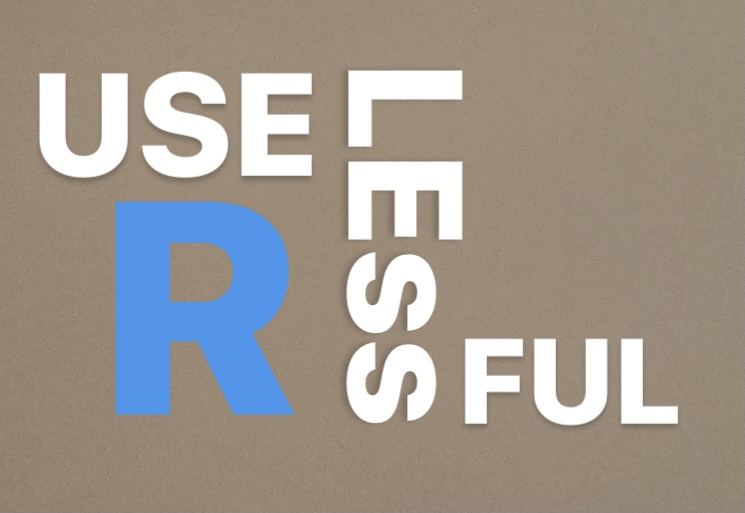

<!-- README.md was wriiten in beautiful MacDown  -->

# Useful - Useless R functions - UUR 



<!-- badges: start -->


<!-- badges: end -->

<span style="font-size: xx-large; font-weight: normal;">`UUR`
is useful, yet useless set of custom R functions using `{base}` for
your everyday R use. That's it :-) And nothing more.</span>


## Feature Summary

  - Mixed Cases ([blog post](https://tomaztsql.wordpress.com/2020/10/17/little-useless-useful-r-function/))
  - DataFrame maker ([blog post](https://tomaztsql.wordpress.com/2020/10/20/little-useless-useful-r-function-dataframe-maker/))
  - R Job Title generator ([blog post](https://tomaztsql.wordpress.com/2020/10/24/little-useless-useful-r-function-r-jobs-title-generator/))
  - Psychedelic Square Root visual with **x11()** ([blog post](https://tomaztsql.wordpress.com/2020/10/26/little-useless-useful-r-function-psychedelic-square-root-with-x11/))
  - Friday 13th obvious searcher 
  - Full moon finder ([blog post](https://tomaztsql.wordpress.com/2020/10/30/little-useless-useful-r-function-full-moon-finder/))
  - Lorem Ipsum R text generator ([blog post](https://tomaztsql.wordpress.com/2020/11/02/little-useless-useful-r-functions-r-lorem-ipsum/))
  - Wacky Password generator ([blog post](https://tomaztsql.wordpress.com/2020/11/06/little-useless-useful-r-functions-wacky-password-generator/))
  - Play Rock-Paper-Scissors with your R Engine ([blog post](https://tomaztsql.wordpress.com/2020/11/13/little-useless-useful-r-functions-play-rock-paper-scissors-with-your-r-engine/))
  - Duplicate and frequent functions used in many R packages ([blog post](https://tomaztsql.wordpress.com/2020/11/18/little-useless-useful-r-functions-same-function-names-from-different-packages-or-namespaces/))
  - Making Scatter Plot from Image file ([blog post](https://tomaztsql.wordpress.com/2020/11/21/little-useless-useful-r-functions-making-scatter-plot-from-an-image/))
  - Function that generates calculator script ([blog post](https://tomaztsql.wordpress.com/2020/11/30/little-useless-useful-r-functions-script-that-generates-calculator-script/))
  - Word scrambler ([blog post](https://tomaztsql.wordpress.com/2020/12/24/little-useless-useful-r-functions-word-scrambler/))
  - Folder TreeMap ([blog post](https://tomaztsql.wordpress.com/2021/01/01/little-useless-useful-r-functions-folder-treemap/))
  - Playing stack of cards ([blog post](https://tomaztsql.wordpress.com/2021/01/03/little-useless-useful-r-functions-playing-stack-of-cards/))
  - R to Python dataFrame ([blog post](https://tomaztsql.wordpress.com/2021/01/05/little-useless-useful-r-functions-create-pandas-dataframe-from-r-data-frame/))
  - Four Fours ([blog post](https://tomaztsql.wordpress.com/2021/01/07/little-useless-useful-r-functions-mathematical-puzzle-of-four-fours/))
  - Countdown Number Puzzle ([blog post](https://tomaztsql.wordpress.com/2021/01/11/little-useless-useful-r-functions-countdown-number-puzzle/))
  - R Version ([blog post](https://tomaztsql.wordpress.com/2021/02/03/little-useless-useful-r-functions-r-version/))
  - R Poem for Valentine ([blog post](https://tomaztsql.wordpress.com/2021/02/08/little-useless-useful-r-functions-useless-r-poem-for-valentine/))
  - Pipe (%>%) for ggplot2 ([blog post](https://tomaztsql.wordpress.com/2021/02/12/little-useless-useful-r-functions-use-pipe-in-ggplot2/))
  - L-Systems ([blog post](https://tomaztsql.wordpress.com/2021/02/17/little-useless-useful-r-functions-using-l-systems-for-useless-writing/))
  - Letter frequency in numbers ([blog post](https://tomaztsql.wordpress.com/2021/03/22/little-useless-useful-r-functions-letter-frequency-in-a-vector-of-numbers/))
  - Using SQL Syntax for wrangling data frames ([blog post](https://tomaztsql.wordpress.com/2021/04/27/using-sql-for-r-data-frames-with-sqldf/))
  - Looping through variable names and generating plots ([blog post](https://tomaztsql.wordpress.com/2021/05/24/little-useless-useful-r-functions-looping-through-variable-names-and-generating-plots/))
  - Inserting variable values into strings ([blog post](https://tomaztsql.wordpress.com/2021/07/09/little-useless-useful-r-functions-inserting-variable-values-into-strings/))
  - Colourful ggplot line graphs ([blog post](https://tomaztsql.wordpress.com/2021/07/16/little-useless-useful-r-functions-colourful-ggplot-line-graphs/))
  - Drawing calendar([blog post](https://tomaztsql.wordpress.com/2021/07/19/little-useless-useful-r-functions-drawing-calendar/))
  - Useless Year progress bar with spinning cursor ([blog post](https://tomaztsql.wordpress.com/2021/09/13/little-useless-useful-r-functions-year-progress-bar/))

## Cloning the repository
You can follow the steps below to clone the repository.
```
git clone https://github.com/tomaztk/Useless_R_functions.git
```

## Quickstart

1.  Clone the repository
2.  Start using any of the functions e.g. `IsItFriday13()`
3.  Explore and enjoy!

<!-- end list -->

``` r
# non-deterministic
IsItFriday13 <- function(){
  #da <- "2020-11-13"
  da <- Sys.Date()
  rn <- as.POSIXlt(da)$wday
  d <- as.POSIXlt(da)$mday 
  
  if (rn == 5 & d == 13){
      print("It is a Friday the 13th!")
  } else {
      print("Not a Friday 13th!")
    }
  }  

IsItFriday13()
```

## Contributors and co-authors

Thanks to these wonderful community people making and helping this useless R functions better. Contributions of any kind is highly appreciated!
<table>
  <tr>
    <td align="center"><a href="https://github.com/riccardoporreca"><br /><sub><b>Riccardo Porreca</b></sub></a><br /></td>
    <td align="center"><a href="https://github.com/retooooo"><br /><sub><b>retooooo</b></sub></a><br /></td>
<td align="center"><a href="https://github.com/mrdwab"><br /><sub><b>mrdwab</b></sub></a><br /></td>
</tr>

</table>


## Contact
Feel free to get in touch for new useful-useless functions.


# Gallery (from blog)

<div>

<a href="https://tomaztsql.files.wordpress.com/2020/10/2020-10-24-21_08_34-plot-zoom.png"></a>
<a href="https://tomaztsql.files.wordpress.com/2020/10/2020-10-29-22_32_07-moon-phase-formula-updated-watchface-design-_-expression-help-facer-commun.png">
</a>
<a href="https://tomaztsql.files.wordpress.com/2020/11/screenshot-2020-11-18-at-00.08.11.png">
</a>
<a href="https://tomaztsql.files.wordpress.com/2020/11/460px-rock-paper-scissors.svg_.png">
  
</a>
<a href="https://tomaztsql.files.wordpress.com/2020/11/2020-11-13-00_36_21-window.png">
  
</a>
<a href="https://tomaztsql.files.wordpress.com/2020/10/screenshot-2020-10-24-at-12.07.30.png">
</a>
<a href="https://tomaztsql.files.wordpress.com/2020/11/screenshot-2020-11-05-at-21.56.59.png">
</a>
<a href="https://tomaztsql.files.wordpress.com/2020/10/2020-10-31-21_18_58-rstudio.png">
  
</a>
<a href="https://tomaztsql.files.wordpress.com/2020/11/screenshot-2020-11-20-at-22.02.11.png">
</a>
<a href="https://tomaztsql.files.wordpress.com/2020/12/screenshot-2020-12-24-at-16.31.20.png">
</a>
<a href="https://tomaztsql.files.wordpress.com/2020/12/screenshot-2020-12-30-at-22.50.49.png">
</a>
   
<a href="https://tomaztsql.files.wordpress.com/2021/01/screenshot-2021-01-05-at-06.37.35.png">
</a>
<a href="https://tomaztsql.files.wordpress.com/2021/01/screenshot-2021-01-10-at-07.29.03.png">
</a>


<a href="https://tomaztsql.files.wordpress.com/2021/02/screenshot-2021-02-07-at-07.59.45.png">
</a>
<a href="https://tomaztsql.files.wordpress.com/2021/02/screenshot-2021-02-12-at-06.11.49.png">
</a>

<a href="https://tomaztsql.files.wordpress.com/2021/03/screenshot-2021-03-20-at-07.53.59.png">
</a>
<a href="https://tomaztsql.files.wordpress.com/2021/05/screenshot-2021-05-23-at-06.14.57.png">
</a>
  
<a href="https://tomaztsql.files.wordpress.com/2021/07/screenshot-2021-07-15-at-18.47.50.png">
</a>
<a href="https://tomaztsql.files.wordpress.com/2021/07/screenshot-2021-07-18-at-07.00.51.png">
</a>
  
<div>


# Vignettes

#### General examples

# ToDo

  - Possibly change some functionalities to work properly on UNIX / WIN machines
    - `x11()` and `CLI export`
  - A vignette finished; write proper feature details!
  - Create useless R package.
