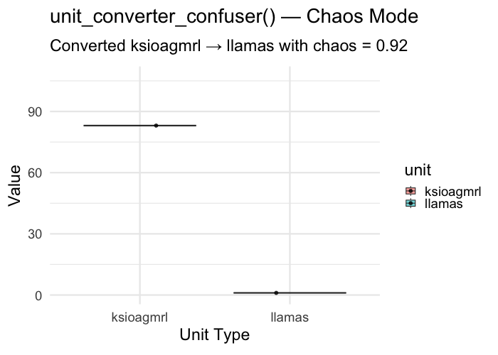

# 🌀 Confused Unit Conversion Report

## Conversion: `ksioagmrl` ➡️ `llamas`
- Chaos Level: 0.92
- Factor Used: 0.01259

## Stats:
- t = 21.66
- p = 7.4033e-15
- Conclusion: 🚨 Statistically SigniFreakant!

## 📽️ Animated Chart

_Brought to you by unit_converter_confuser() and 2 cups of chaos._
